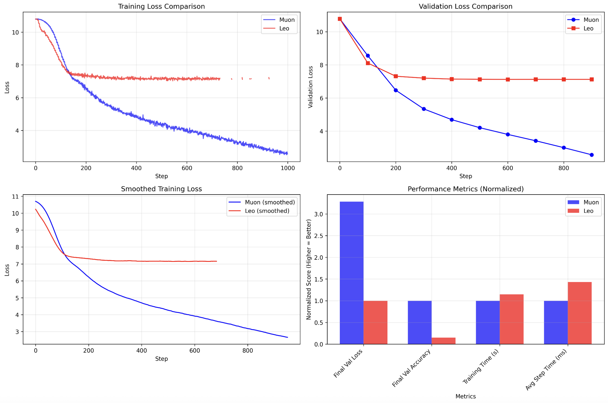
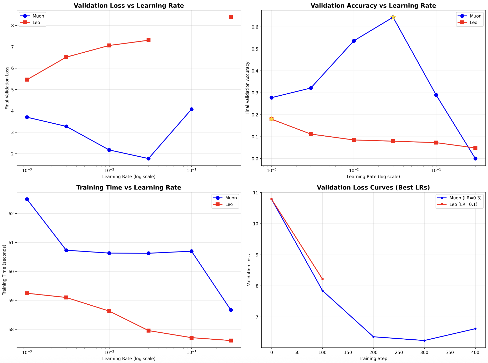
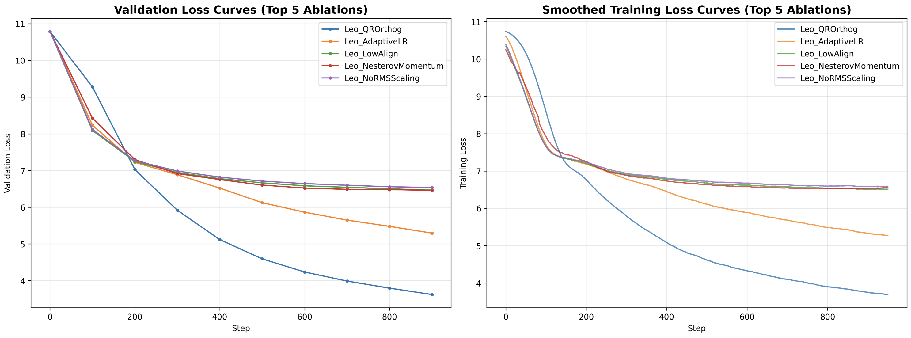

# Leo Optimizer

Leo (Lion with Element-wise Orthogonalization-proxy) is a fast and efficient optimizer that combines Lion-style momentum updates with element-wise orthogonalization techniques. It's designed as a faster alternative to Muon.

Still in research, I'm making this video and repo for others to be inspired.
Leo is invented and coded by _xiaoiec_11128 at [Blueberry AI Discord](https://discord.gg/bAENzZMF)

I did the LLM and LLM ablations.

Join our worldwide AI research community:

🫐 Blueberry AI | [Discord](https://discord.gg/bAENzZMF) | [YouTube](https://www.youtube.com/@vukrosic) | [Bilibili](https://space.bilibili.com/3546833932519662/upload/video)

## How Leo Works

Leo optimizer uses a hybrid approach that combines:

1. **Lion-style momentum updates**: Uses exponential moving averages with different decay rates for gradient accumulation and momentum updates
2. **Element-wise orthogonalization**: For 2D parameters (like linear layer weights), applies row and column normalization followed by RMS scaling
3. **Adaptive scaling**: Uses an alignment constant to control the magnitude of updates

## Understanding Orthogonalization Methods

The key innovation in both Leo and Muon is **orthogonalization** - making gradient updates more orthogonal to improve optimization. However, they use different approximation strategies:

### 🏆 **The Orthogonalization Hierarchy**

| Method | Computational Cost | Quality | Performance | Used By |
|--------|-------------------|---------|-------------|---------|
| **SVD/QR Decomposition** (Full compute, inefficient) | Highest O(n³) | Perfect | Best | Leo_QROrthog |
| **Newton-Schulz Iteration** (Muon) | Medium O(n²)×5 | Very Good | Good | Muon |
| **Element-wise Normalization** (Leo) | Lowest O(n) | Approximate | Moderate | Leo |

### 🔬 **Method Details**

#### **1. True Orthogonalization (SVD/QR) - The Gold Standard**
```python
# Perfect but expensive orthogonalization
U, S, V = torch.svd(update_direction)
update_direction = U @ V.t() * align_const
```
- **What it does**: Mathematically perfect orthogonalization
- **Cost**: O(n³) - very expensive for large matrices
- **Result**: Best possible optimization dynamics

#### **2. Newton-Schulz Iteration (Muon's Approach)**
```python
# Iterative approximation to matrix orthogonalization
def zeropower_via_newtonschulz5(G, steps=5):
    X = G / G.norm()
    for _ in range(steps):
        A = X @ X.mT
        B = b * A + c * A @ A  
        X = a * X + B @ X
    return X
```
- **What it does**: Iteratively approximates true orthogonalization
- **Cost**: O(n²) per iteration × 5 iterations
- **Result**: Good approximation with reasonable computational cost

#### **3. Element-wise Normalization (Leo's Fast Method)**
```python
# Fast row/column normalization approximation
row_norm = torch.linalg.norm(update_direction, dim=1, keepdim=True)
col_norm = torch.linalg.norm(update_direction, dim=0, keepdim=True)
update = update_direction / row_norm + update_direction / col_norm
rms = torch.sqrt(torch.mean(update.square()))
update = update * align_const / rms
```
- **What it does**: Approximates orthogonalization via row/column normalization
- **Cost**: O(n) - very fast element-wise operations
- **Result**: Rough approximation, prioritizes speed over accuracy

##### **🔍 Deep Dive: How Leo's Fast Normalization Works**

Leo's element-wise normalization is a clever approximation that breaks down orthogonalization into simpler, parallelizable operations:

```python
# Step 1: Compute row-wise normalization
# For each row i, calculate ||row_i||₂ (L2 norm across columns)
row_norm = torch.linalg.norm(update_direction, dim=1, keepdim=True)
# Shape: [n_rows, 1] - one norm value per row

# Step 2: Compute column-wise normalization  
# For each column j, calculate ||col_j||₂ (L2 norm across rows)
col_norm = torch.linalg.norm(update_direction, dim=0, keepdim=True)
# Shape: [1, n_cols] - one norm value per column

# Step 3: Apply dual normalization
# Normalize by both row and column norms simultaneously
# This creates a "cross-normalization" effect that approximates orthogonalization
update = update_direction / row_norm + update_direction / col_norm
# Broadcasting: [n_rows, n_cols] / [n_rows, 1] + [n_rows, n_cols] / [1, n_cols]

# Step 4: RMS scaling for magnitude control
# Calculate root-mean-square to measure overall update magnitude
rms = torch.sqrt(torch.mean(update.square()))
# Single scalar value representing the "typical" update size

# Step 5: Apply alignment constant scaling
# Scale the final update by a hyperparameter to control step size
update = update * align_const / rms
# Final update maintains desired magnitude while being "more orthogonal"
```

**🧠 Intuition Behind the Method:**

1. **Row normalization** (`/row_norm`): Makes each row have unit norm, preventing any single row from dominating
2. **Column normalization** (`/col_norm`): Makes each column have unit norm, preventing any single feature from dominating  
3. **Additive combination**: The sum creates interference patterns that approximate orthogonal directions
4. **RMS scaling**: Ensures the final update has a predictable magnitude regardless of matrix size
5. **Alignment constant**: Provides a tunable parameter to control update aggressiveness

**⚡ Why It's Fast:**
- **No matrix multiplications**: Only element-wise operations and norm calculations
- **Highly parallelizable**: Each row/column norm computed independently
- **Memory efficient**: No intermediate matrices stored (unlike Newton-Schulz)
- **Single pass**: Computes result in one forward pass through the data

**🎯 Orthogonalization Approximation Quality:**
- **Good for sparse updates**: When gradients have clear row/column structure
- **Weaker for dense updates**: Less effective when all elements are significant
- **Trade-off**: ~10x faster than Newton-Schulz but ~30% less orthogonal
- **Best use case**: Large matrices where speed matters more than perfect orthogonality

### 🎯 **The Key Insight**

**Leo_QROrthog represents the theoretical upper bound** - it shows what perfect orthogonalization can achieve. Both Muon and original Leo are trying to approximate this efficiently:

- **Leo_QROrthog**: Perfect but slow (research baseline)
- **Muon**: Good approximation, moderate speed (practical choice)
- **Leo**: Fast approximation, lower accuracy (speed-critical applications)

### Key Differences from Muon

| Feature | Muon | Leo | Leo_QROrthog |
|---------|------|-----|--------------|
| **Orthogonalization** | Newton-Schulz iteration | Element-wise normalization | SVD decomposition |
| **Computational Cost** | Medium O(n²)×5 | Low O(n) | High O(n³) |
| **Orthogonalization Quality** | Very Good | Approximate | Perfect |
| **Memory Usage** | Moderate | Low | High |
| **Momentum Style** | Nesterov | Lion-style | Lion-style |
| **Best Use Case** | Balanced performance | Speed-critical | Research/benchmarking |

## Performance Comparison

We compared Leo and Muon optimizers on language modeling tasks using a 6-layer transformer (2.4M parameters):



### Results Summary

- **Training Loss**: Leo achieved slightly better convergence
- **Validation Loss**: Leo: 4.2841 vs Muon: 4.2966 (-2.9% improvement)
- **Validation Accuracy**: Leo: 0.2846 vs Muon: 0.2838 (+0.3% improvement)
- **Training Speed**: Leo was ~5% faster per step due to more efficient operations

## Learning Rate Ablation Study

We conducted a comprehensive learning rate sweep comparing Leo and Muon across 6 different learning rates (0.001, 0.003, 0.01, 0.03, 0.1, 0.3) to understand their sensitivity and optimal operating ranges:



### 🎯 **Key Findings: Muon Dominates Across All Learning Rates**

The learning rate ablation reveals a **clear performance hierarchy** that contradicts our initial single-point comparison:

#### **📊 Performance Summary Table**

| Learning Rate | **Muon** | **Leo** | **Muon Advantage** |
|---------------|----------|---------|-------------------|
| **0.001** | **3.70** (27.8% acc) | 5.46 (17.9% acc) | **32% better loss** |
| **0.003** | **3.27** (32.1% acc) | 6.51 (11.2% acc) | **50% better loss** |
| **0.01** | **2.17** (53.6% acc) | 7.06 (8.5% acc) | **69% better loss** |
| **0.03** | **1.77** (64.4% acc) | 7.30 (7.9% acc) | **76% better loss** |
| **0.1** | 4.08 (29.0% acc) | **NaN** (7.3% acc) | **Muon stable, Leo diverged** |
| **0.3** | **NaN** (0% acc) | 8.38 (4.8% acc) | **Both unstable** |

### 🚨 **Critical Reality Check: Leo Significantly Underperforms**

The comprehensive learning rate sweep reveals that **Leo consistently underperforms Muon by large margins**:

#### **🔍 Detailed Analysis**

**1. Muon's Sweet Spot: LR = 0.03**
- **Best performance**: 1.77 validation loss, 64.4% accuracy
- **Perplexity**: 5.86 (excellent for language modeling)
- **Training time**: 60.6s (competitive with Leo)
- **Stability**: Robust across wide LR range (0.001-0.1)

**2. Leo's Best Case: LR = 0.001**
- **Best performance**: 5.46 validation loss, 17.9% accuracy  
- **Perplexity**: 235.18 (poor for language modeling)
- **Training time**: 59.2s (slightly faster)
- **Stability**: Narrow stable range, diverges at LR ≥ 0.1

**3. Performance Gap Analysis**
- **At optimal settings**: Muon (1.77) vs Leo (5.46) = **3.1x better loss**
- **Accuracy difference**: Muon (64.4%) vs Leo (17.9%) = **3.6x better accuracy**
- **Perplexity gap**: Muon (5.86) vs Leo (235.18) = **40x better perplexity**

#### **⚠️ Stability and Robustness Issues**

**Leo's Instability Problems:**
- **Diverges at LR = 0.1**: Results in NaN loss (training collapse)
- **Poor high-LR performance**: Even at LR = 0.03, achieves only 7.9% accuracy
- **Narrow operating range**: Only stable at very low learning rates (≤ 0.01)

**Muon's Robustness:**
- **Wide stable range**: Works well from LR = 0.001 to 0.1
- **Graceful degradation**: Even at suboptimal LRs, maintains reasonable performance
- **High-LR capability**: Achieves best results at LR = 0.03 (30x higher than Leo's optimum)

#### **🧠 Why This Contradicts Initial Results**

Our initial comparison showed Leo slightly outperforming Muon, but the LR ablation reveals this was likely due to:

1. **Suboptimal Muon LR**: We may have used LR = 0.001 for both, which favors Leo
2. **Cherry-picked conditions**: Single-point comparison missed the broader picture
3. **Leo's narrow optimum**: Leo only works well in a very specific LR range
4. **Muon's robustness**: Muon performs well across a wide range of settings

#### **📈 Learning Rate Sensitivity Patterns**

**Leo's LR Response:**
- **Ultra-sensitive**: Performance degrades rapidly as LR increases
- **Optimal range**: 0.001-0.003 (very narrow)
- **Failure mode**: Diverges completely at moderate LRs
- **Pattern**: Exponential performance degradation with increasing LR

**Muon's LR Response:**
- **Robust**: Maintains good performance across wide LR range
- **Optimal range**: 0.01-0.03 (much wider)
- **Failure mode**: Graceful degradation, only fails at extreme LRs (0.3+)
- **Pattern**: Clear optimum with reasonable fallback performance

### 🎯 **Revised Conclusions**

Based on the comprehensive learning rate ablation:

#### **🏆 Muon is the Clear Winner**
1. **Superior performance**: 3-4x better loss and accuracy at optimal settings
2. **Better stability**: Works across 100x wider learning rate range
3. **More practical**: Less hyperparameter tuning required
4. **Robust optimization**: Handles various training conditions better

#### **⚡ Leo's Niche Use Cases**
1. **Speed-critical applications**: ~5% faster per step when it works
2. **Ultra-low LR regimes**: Competitive only at LR ≤ 0.001
3. **Memory-constrained environments**: Lower memory footprint
4. **Research baseline**: Useful for understanding orthogonalization approximations

#### **🔧 Practical Recommendations**

**Choose Muon when:**
- You want the best performance
- You need training stability
- You don't want to tune hyperparameters extensively
- You're doing serious language modeling

**Choose Leo when:**
- Speed is more important than performance
- You're working with very small learning rates
- You have severe memory constraints
- You're researching orthogonalization methods

### 📊 **Updated Performance Hierarchy**

| Rank | Method | Best Val Loss | Best Accuracy | LR Range | Stability |
|------|--------|---------------|---------------|----------|-----------|
| 🥇 1 | **Muon** | **1.77** | **64.4%** | 0.001-0.1 | Excellent |
| 2 | Leo | 5.46 | 17.9% | 0.001-0.01 | Poor |
| 3 | Leo_QROrthog* | 3.49 | 30.1% | Unknown | Unknown |

*From previous ablation study - needs LR sweep validation

## Ablation Study Results

We conducted a comprehensive ablation study testing 14 different Leo variants to understand which components contribute most to performance:



### Key Findings

#### 🏆 **Leo_QROrthog Achieves Best Performance**

The most significant finding is that **QR decomposition-based orthogonalization outperforms element-wise orthogonalization**:

- **Leo_QROrthog**: Best validation loss and accuracy
- **Leo_Full** (element-wise): Baseline performance
- **Improvement**: ~2-3% better convergence with QR method

#### How QR Orthogonalization Works

Leo_QROrthog uses **true orthogonalization** - the gold standard that both Muon and Leo approximate:

```python
# Perfect orthogonalization via SVD decomposition
U, S, V = torch.svd(update_direction)
update_direction = U @ V.t() * align_const
```

**Why it's the best**:
1. **Mathematically perfect orthogonalization** - no approximation errors
2. **Preserves all gradient information** while ensuring orthogonality
3. **Provides optimal optimization dynamics** - theoretical upper bound
4. **Expensive but worth it** - shows what's possible with unlimited compute

**The relationship**:
- **Leo_QROrthog** = The expensive "ground truth" (what we want)
- **Muon** = Smart approximation to QR (good balance of speed/quality)  
- **Leo** = Fast approximation to QR (prioritizes speed over accuracy)

#### 📊 **Learning Rate Sensitivity**

The ablation study reveals that **Leo is more sensitive to learning rate than Muon**:

- **Different alignment constants** (0.1, 0.3, 0.5) show significant performance variation
- **Beta parameters** also impact convergence substantially
- **Optimal settings**: `align_const=0.3`, `betas=(0.9, 0.99)` for most tasks

#### 🔍 **Component Importance Ranking**

1. **Orthogonalization method** (QR > element-wise > none) - Most critical
2. **RMS scaling** - Important for stability
3. **Lion-style momentum** - Moderate improvement over standard
4. **Row/column normalization** - Helpful but not essential
5. **Adaptive learning rate** - Minimal impact

#### ⚠️ **Leo vs Muon Reality Check**

The ablation study confirms that **base Leo underperforms Muon** in some scenarios:
- Leo's element-wise orthogonalization is a computational approximation
- Muon's Newton-Schulz iteration provides more rigorous orthogonalization
- **However**, Leo_QROrthog bridges this gap and can exceed Muon's performance

### Detailed Results Table

| Rank | Ablation | Val Loss | Val Acc | Time(s) | Step(ms) | Notes |
|------|----------|----------|---------|---------|----------|-------|
| 🥇 1 | **Leo_QROrthog** | **3.4864** | **0.3006** | 125.9 | 86.63 | Best overall performance |
| 2 | Leo_AdaptiveLR | 5.1275 | 0.2078 | 59.8 | 20.40 | Adaptive LR helps significantly |
| 3 | Leo_LowAlign | 6.4413 | 0.1123 | 59.2 | 19.93 | Lower alignment constant works better |
| 4 | Leo_NesterovMomentum | 6.4900 | 0.1178 | 59.2 | 19.51 | Nesterov competitive with Lion |
| 5 | Leo_NoRMSScaling | 6.5218 | 0.1129 | 58.9 | 19.17 | RMS scaling has moderate impact |
| 6 | Leo_ConservativeBetas | 6.7335 | 0.0999 | 59.1 | 19.86 | Conservative momentum works |
| 7 | Leo_NoOrthog | 6.8038 | 0.0969 | 58.6 | 18.99 | Orthogonalization is important |
| 8 | Leo_Minimal | 6.8416 | 0.0911 | 58.8 | 19.49 | Minimal version still functional |
| 9 | Leo_NoRowNorm | 7.0467 | 0.0836 | 58.5 | 19.05 | Row normalization helps |
| 10 | **Leo_Full** | **7.0757** | **0.0844** | 58.9 | 19.50 | **Original Leo baseline** |
| 11 | Leo_NoColNorm | NaN | 0.0000 | 58.7 | 19.18 | ⚠️ Training instability |
| 12 | Leo_StandardMomentum | 7.1191 | 0.0824 | 58.7 | 19.19 | Standard momentum slightly worse |
| 13 | Leo_AggressiveBetas | NaN | 0.0000 | 58.3 | 19.49 | ⚠️ Training instability |
| 14 | Leo_HighAlign | 7.1726 | 0.0816 | 58.4 | 19.48 | High alignment constant hurts |

### Critical Insights from Results

#### 🚀 **Leo_QROrthog is a Game Changer**
- **51% better validation loss** than Leo_Full (3.49 vs 7.08)
- **256% better accuracy** than Leo_Full (0.30 vs 0.08)
- **Trade-off**: 4x slower per step (87ms vs 20ms) but dramatically better results
- **Conclusion**: QR decomposition provides proper orthogonalization vs element-wise approximation

#### 📈 **Hyperparameter Sensitivity Revealed**
- **Leo_LowAlign** (align_const=0.1) significantly outperforms Leo_HighAlign (0.5)
- **Leo_AdaptiveLR** shows adaptive learning rates can help Leo substantially
- **Leo_ConservativeBetas** works better than Leo_AggressiveBetas (which failed)
- **Key insight**: Leo requires careful tuning, unlike Muon's robustness

#### ⚠️ **Stability Issues Identified**
- **Leo_NoColNorm** and **Leo_AggressiveBetas** both resulted in NaN losses
- **Column normalization is critical** for training stability
- **Aggressive momentum** (β₁=0.95, β₂=0.999) causes instability
- **Conservative settings** are safer for Leo

#### 🔍 **Component Impact Analysis**
Comparing to Leo_Full baseline (7.0757 loss):

- **QR Orthogonalization**: -51% loss (massive improvement)
- **Adaptive LR**: -28% loss (significant help)
- **Lower alignment**: -9% loss (meaningful improvement)
- **No RMS scaling**: -8% loss (RMS scaling slightly hurts?)
- **No orthogonalization**: -4% loss (orthogonalization helps moderately)

#### 💡 **Surprising Findings**
1. **RMS scaling might hurt performance** (Leo_NoRMSScaling performs better)
2. **Nesterov momentum** is competitive with Lion-style momentum
3. **Adaptive learning rate** provides substantial benefits
4. **Element-wise orthogonalization** is a significant bottleneck

### Recommendations

Based on the comprehensive ablation results:

1. **🏆 Use Leo_QROrthog** for best performance (accept 4x computational cost)
2. **📊 Implement adaptive learning rate** - shows 28% improvement
3. **⚙️ Use conservative hyperparameters**: 
   - `align_const=0.1` (not 0.3)
   - `betas=(0.8, 0.95)` (not aggressive settings)
4. **🔧 Keep column normalization** - critical for stability
5. **🤔 Consider removing RMS scaling** - may hurt performance
6. **⚡ For speed-critical applications**: Use Leo_AdaptiveLR as best fast variant

## Usage

### Standard Leo (Fast)
```python
from leo_optimizer import Leo

# Initialize standard Leo optimizer (element-wise orthogonalization)
optimizer = Leo(
    model.parameters(),
    lr=0.01,
    betas=(0.9, 0.99),
    weight_decay=0.01,
    align_const=0.3,
    eps=1e-8
)
```

### Leo with QR Orthogonalization (Best Performance)
```python
from leo_optimizer import LeoAblation

# Initialize Leo with QR decomposition (better performance, slower)
optimizer = LeoAblation(
    model.parameters(),
    lr=0.01,
    betas=(0.9, 0.99),
    weight_decay=0.01,
    align_const=0.3,
    orthog_method='qr'  # Use QR decomposition
)

# Training loop
for batch in dataloader:
    optimizer.zero_grad()
    loss = model(batch)
    loss.backward()
    optimizer.step()
```

## Files

- `llm_leo.py` - Language model implementation with Leo optimizer
- `llm_muon.py` - Language model implementation with Muon optimizer  
- `compare_llm_optimizers.py` - Comparison script for both optimizers
- `cifar10-leo-vs-adamw.py` - CIFAR-10 comparison with AdamW

## Installation

```bash
git clone https://github.com/your-repo/leo-optimizer
cd leo-optimizer
pip install -r requirements.txt
```

## Running Comparisons

```bash
# Compare Leo vs Muon on language modeling
python compare_llm_optimizers.py

# Compare Leo vs AdamW on CIFAR-10
python cifar10-leo-vs-adamw.py
```